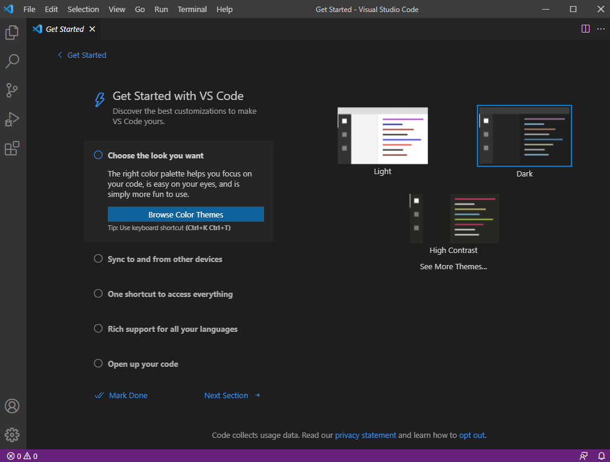
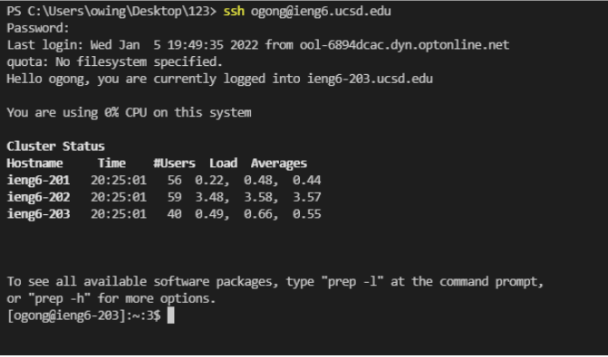

# **Lab Report 1**
January 14, 2022
  
  
# Installing Vs Code
Go to the [Visual Studio Code website](https://code.visualstudio.com/) and download version matching your system. Open VSCode after installing.

  
# Remotely Connecting
If using Windows,install [OpenSSh](https://docs.microsoft.com/en-us/windows-server/administration/openssh/openssh_install_firstuse). Look up your course-specific account at https://sdacs.ucsd.edu/~icc/index.php. Open a terminal in VSCode and enter "$ ssh cs15lwi22??@ieng6.ucsd.edu" while replacing the question marks with the letter in the personal email. Say yes and enter your password to login.

