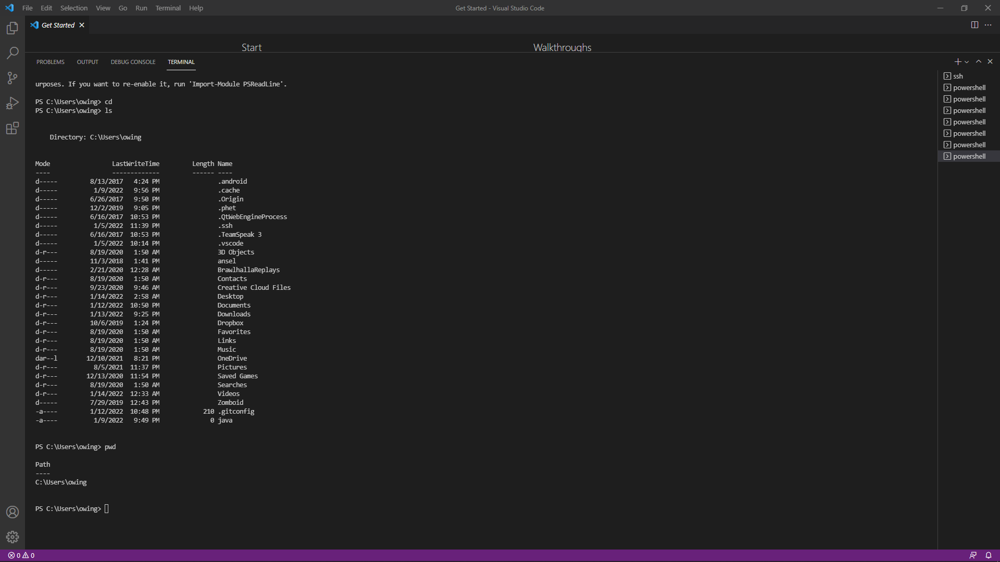
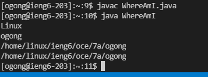
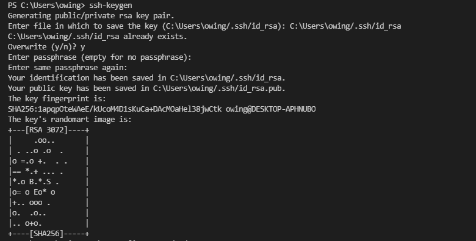
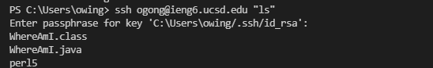

# **Lab Report 1**
January 14, 2022
  
  
# Installing Vs Code
Go to the [Visual Studio Code website](https://code.visualstudio.com/) and download version matching your system. Open VSCode after installing.

  
# Remotely Connecting
If using Windows,install [OpenSSh](https://docs.microsoft.com/en-us/windows-server/administration/openssh/openssh_install_firstuse). Look up your course-specific account at https://sdacs.ucsd.edu/~icc/index.php. Open a terminal in VSCode and enter "$ ssh cs15lwi22??@ieng6.ucsd.edu" while replacing the question marks with the letter in the personal email. Say yes and enter your password to login.

  
# Trying Some Commands
In the terminal, try these commands. Write down some notes about what those commands do.
* cd (changes directory)
* cd ~ (changes directory to home directory)
* ls (list files)
* ls -lat (list filessoted by date)
* ls -a (list everything)
* pwd (print work directory)
* mkdir (creates directory)
* cp /home/linux/ieng6/cs15lwi22/public/hello.txt ~/ (copy files)
* cat /home/linux/ieng6/cs15lwi22/public/hello.txt (print files)

  
# Moving Files with scp
Create a new java file. In the terminal run "scp 'file name' 'username'@ieng6.ucsd.edu:~/". Log into ssh again and enter lp in the terminal to move the file.

  
# Setting an SSH Key
Enter "ssh-keygen" into the terminal. Enter the file shows in the parentheses and enter your key. Windows need another  ssh-add step : https://docs.microsoft.com/en-us/windows-server/administration/openssh/openssh_keymanagement#user-key-generation 

Log into your account and enter "mkdir .ssh", logout, and enter "scp "public key file" "username"@ieng6.ucsd.edu:~/.ssh/authorized_keys" to finish setup the key.

  
# Optimizing Remote Running
Ther are different ways you can use to optimize remote running. You can make a command before loggin in by adding "command" after ssh. You can also separate your code into different lines using semicolons. 
