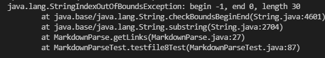

# **Lab Report 2**
January 27, 2022
  
  
# Code Change 1
  
Code change diff:

[link to the file that caused the error](https://github.com/littlefishy1/markdown-parse/commit/0290a53148a94a4d8c0c6c63eff48edfce44e838)

Symptoms:

The bug is that the loop only stops when the file does not end with ")" such that currentIndex is no longer smaller tham the length of the file. The symptom caused by it is that if the file does not end with ")" then the loop is going to be infinite and will never break. New.md is an example of such files which caused the symptoms.

  
# Code Change 2
  
Code change diff:

[link to the file that caused the error](https://github.com/littlefishy1/markdown-parse/blob/main/new3.md)

Symptoms: 

The bug is that the code accounts for brackets and parentheses for links. The symptom caused by it is that an image would be printed as a link when it is not supposed to be printed. New3.md is an example of image which would be printed as a link due to the bug.

  
# Code Change 3
  
Code change diff: 

[link to the file that caused the error](https://github.com/littlefishy1/markdown-parse/blob/main/test-file8.md)

Symptoms: 

The bug is that the code did not account for the cases where the file start with "[". The symptom caused by it is that exception would be called when the nextOpenBracket-1 = -1 which would lead to an index of -1. test-file8.md is an example of such cases where the file starts with "[".