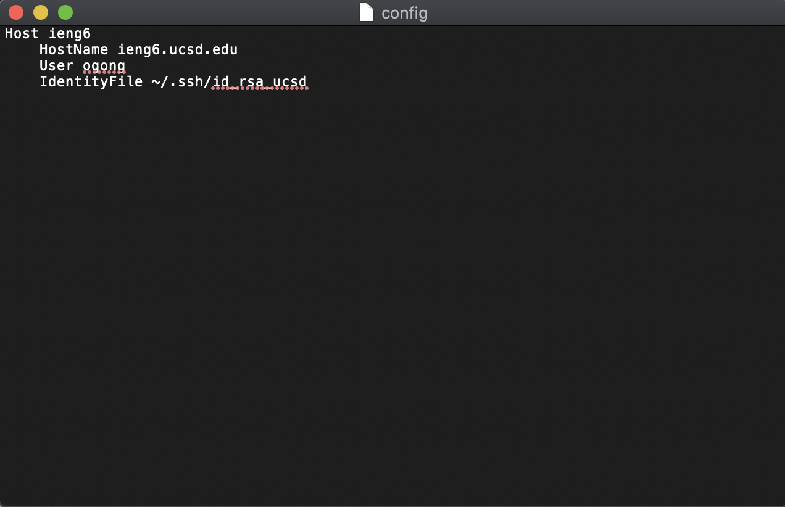
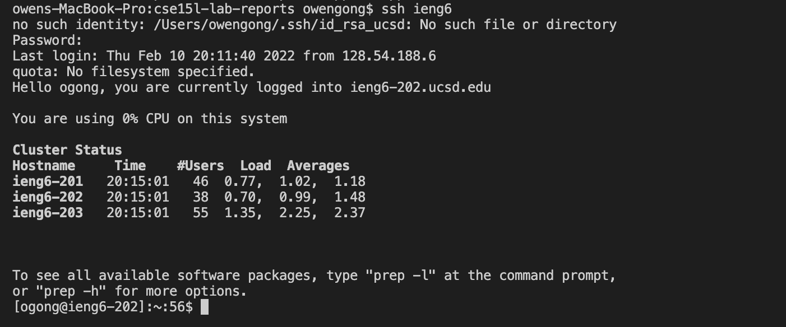

# **Lab Report 3**
February , 2022
<br/><br/>
<br/><br/>
# ```.ssh/config``` file
<br/><br/>


I entered ```touch ~/.ssh/config``` into the terminal to create the file and entered ```open ~/.ssh/config``` to open the file for editing. 

<br/><br/>
# Login
<br/><br/>


I used ieng as my alias. I was able to login using ```ssh ieng6``` after setting up the file.

<br/><br/>
# Copying a File
<br/><br/>


I was able to copy 123.java to the remote computer using ```scp 123.java ieng6:~/```.