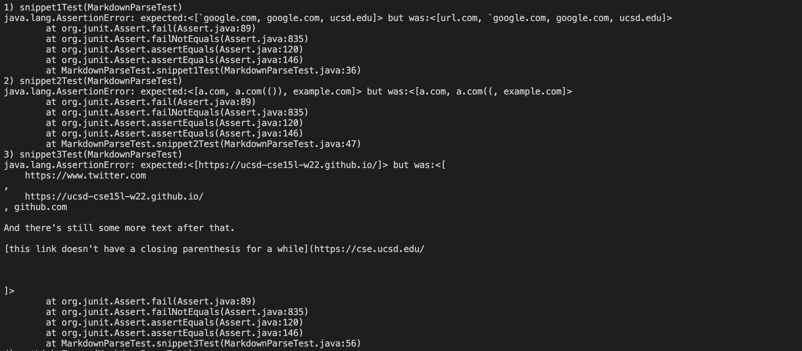

# **Lab Report 4**
February 24, 2022
  
  
# Test code
  
The result for the first snippet should be [`google.com, google.com, ucsd.edu]. The result for the second snippet should be [a.com, a.com(()), example.com]. The result for the third snippet should be [https://ucsd-cse15l-w22.github.io/']. 

  
# Own implementation 
[Repository](https://github.com/littlefishy1/markdown-parse)
  

For snippet 1, there could be code checking if there is one ` infront of the first bracket. If yes then then the first bracket should not be accounted for. If there are even number of ' then it would be ignored. for snippet 2, there could be code checking if there are closed parenthesis after the frist closed parenthesis. If there is one then change the index of closeParen. For snippet 3, there could be a change where the programs to remove the spaces and see if there is a different line between the brackets. However, it would be a challenge to detect new lines in brackets and parenthesis because it would be hard to tell if the link includes brackets or it is the start of another link.
  
# Reviewed implementation 
[Repository](https://github.com/CaoAssignments/cse12-wi22-pa6-Stacks-and-Queues-starter)
  

The fix for the code would be the same as my own implementation since the actual returns for those snippets are the same for the two implementations. The code could be fix the same way.