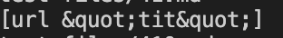
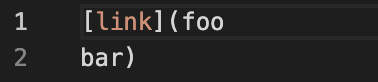
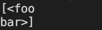

# **Lab Report 5**
March 9, 2022
<br/><br/>
<br/><br/>
# Methods to find differences
<br/><br/>
I found the differences between the results by storing the results of bash scripts into two different text files and run ```diff -y``` between the two files. This command compares the results side by side and shows the differences
<br/><br/>
# Difference 1 (test-files/41.md)
<br/><br/>
Test file:


Lab 9 implementation result:


Own implementation result:



Code need to be fixed:


The Lab 9 implementation is correct. The bug in the code is that it does not check if there are spaces between the brackets. It straight adds the everything between the brackets. A fix to it is to just check if there are spaces between the brackets. If so, then do not add to toReturn.
<br/><br/>
# Difference 2 (test-files/41.md)
<br/><br/>

Test file:



Lab 9 implementation result:


Own implementation result:



Code need to be fixed:


The Lab 9 implementation is correct. The bug in the code is that it does not check if there is a new line between the brackets. It straight adds the everything between the brackets. A fix to it is to just check if there are line changes between the brackets. If so, then do not add to toReturn.
